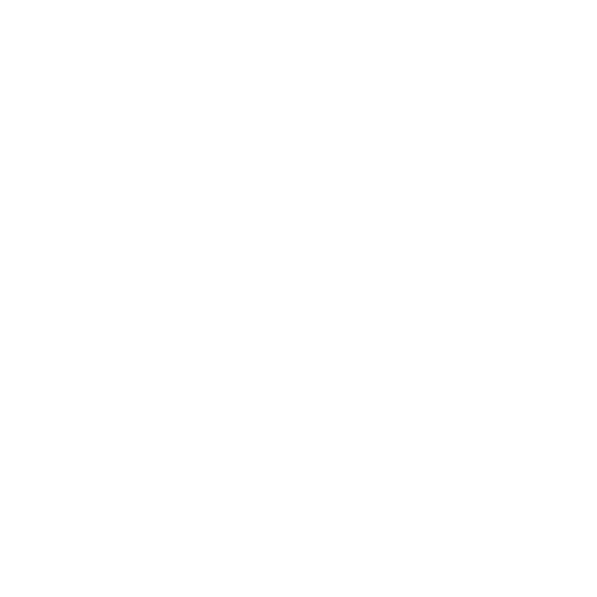

#  RECIPE APP - RESTful JSON API with Spring Boot

# OVERVIEW

# TECHNOLOGIES USED
* ##  Spring Boot
* ##  Java 
* ##  PostgreSQL 
* ##  JSON Web Tokens
* ##  Postman 
* ##  IntelliJ IDEA
* ##  Ubuntu  

# FUNCTIONALITY
| Endpoint |	Functionality | 	Access |
|----------|------------------|-------------|
| POST /auth/users/register   |	Registers a user |	PUBLIC |
| POST /auth/users/login |	Logs a user in |	PUBLIC |
|GET /api/categories |	Lists all categories |	PRIVATE |
|GET /api/categories/{id} |	Gets a single category with the suppled id |	PRIVATE|
| POST /api/categories |	Creates a new category |	PRIVATE |
|PUT /api/categories/{id} |	Updates a category with the suppled id |	PRIVATE|
|DELETE /api/categories/{id} |	Deletes a category with the suppled id |	PRIVATE|
|POST /api/categories/{id}/recipes |	Creates a new recipe in the given category |	PRIVATE|
|GET /api/categories/{id}/recipes |	List all recipes in the given category |	PRIVATE|
|PUT /api/categories/{id}/recipes/{id} |	Updates a recipe in the given category 	|PRIVATE|
|DELETE /api/categories/{id}/recipes/{id} |	Deletes a recipe in the given category |	PRIVATE|